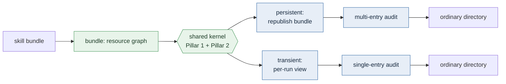

<div align="center">

<picture>
  <source media="(prefers-color-scheme: dark)" srcset="assets/logo-dark.png">
  
</picture>

# SkillZip Pro

**Execution-Aware Dynamic Compression of Progressively Loaded Skills<br/>for Self-Evolving Agents**

<p>
  <a href="LICENSE"></a>
  
  
  
  
</p>

<p>
  
  &nbsp;&nbsp;&nbsp;&nbsp;
  
</p>

</div>

---

## What this is

A production agent skill is rarely one prompt. It is a **bundle**: a root
`SKILL.md` loaded at activation, plus references, schemas, scripts, assets, and
nested subskills that are disclosed only along the execution path that needs
them.

Compressing only the root reports a flattering ratio while leaving most deployed
text untouched — and can even *raise* per-run cost by pulling branch-specific
detail into the always-loaded layer. Flattening the whole directory avoids that
accounting gap but destroys the loading boundaries that make progressive
disclosure useful.

**SkillZip Pro compresses the whole bundle without changing the agent harness.**
The output is still an ordinary directory with ordinary relative links: no
resolver, no hook, no protocol change.

Two properties are structural, not configurable:

- 🔒 **Evaluation-free.** Compression reads *only* skill text — never tasks,
  rewards, trajectories, or verifiers. It cannot overfit to an evaluation set.
- 🛡️ **Never inflates.** The verbatim bundle is always a candidate. If a
  compressed candidate is not strictly better, or fails its audit, the original
  ships. The failure mode is *under*-compression, never corruption.

## What SkillZip Pro adds over SkillZip

[SkillZip](https://arxiv.org/pdf/2608.11079) compressed **one `SKILL.md`** by
recovering the typed behavioral contract it encodes and re-expressing it in the
shortest faithful form. SkillZip Pro keeps that kernel and lifts it to a
progressively loaded **bundle**, which requires four genuinely new capabilities.

| | New in Pro | Why a single-document compressor cannot do it |
| :-- | :-- | :-- |
| 🧩 | **Pillar 1 — activation-aware cross-file compression** | Removes text in a reference or subskill that the **root or environment already covers**, factors text repeated across branches into a shared module placed *inside the activation scope that loads it*, and moves long guarded branches into on-demand capsules. Requires seeing the whole resource graph at once. |
| 🔗 | **Pillar 2 — cross-file routing preservation** | A routing line (“when X happens, read `refs/x.md`”) looks like prose but *is* the navigation table. Pro locks it, preserves every reference line through rewriting, and re-reads the published directory to prove every file is still reachable. A one-file compressor has no routing to break. |
| 🚪 | **Entry contracts** | Every resource is labelled `private`, `public`, or `conditional`, so the compressor knows which files must keep working when **called directly**. A single document is always its own entry, so the question never arises. |
| ♻️ | **Compression lifecycle (Persistent / Transient)** | Chooses whether the result **replaces the shipped bundle** or is built **per run** and discarded. Only meaningful once compression has a deployment footprint across many files. |

Also extended from SkillZip: the cost model (one length model → catalog,
activation, deployment, and path costs), the audit (single-document structural
audit → cross-file closure, scope, coverage, and byte-preservation audit before
**atomic publication**), and Zip-on-Write (per-document patches → per-bundle
patches with dependency-closure invalidation and periodic global repack).

### Two axes, and they are independent

Update frequency decides *when* the kernel runs. Lifecycle decides *where its
output goes*. Both combinations of both axes are valid deployments.

|  | **Persistent** (rewrite the shipped bundle) | **Transient** (bundle untouched) |
| :-- | :-- | :-- |
| **One-Shot** | first migration of an evolved library | a stable bundle whose entries are called directly and rarely |
| **Continual** | a library that keeps evolving and is re-shipped | frequent direct calls against a frequently edited bundle |

Both lifecycles call the **same kernel**; they differ only at its output
boundary:

| | Persistent | Transient |
| :-- | :-- | :-- |
| May delete | text covered for *every* public entry, permanently | text not needed for *this* run, temporarily |
| Audits | all declared public entries, before publishing | the one chosen entry, before the run |
| Publishes to | the shipped bundle on disk | a scratch or cached view beside the run |
| Cache | none — the result *is* the bundle | keyed by (bundle digest, entry, environment) |
| On failure | ship the verbatim bundle | load the verbatim closure |

> **Their ratios are never mixed.** Persistent reports disk *and* per-run cost.
> Transient leaves disk unchanged by construction, so it reports per-run context
> saving only — and it must be read net of its build cost.

## Quick start

No installation and no third-party packages are needed for the deterministic path.

```bash
git clone <repository-url> && cd skillzip-pro

python compress_demo.py       # compress one SKILL.md
python lifecycle_demo.py      # persistent vs. transient on a multi-entry bundle
python -m pytest tests/ -q    # 30 deterministic tests
```

`lifecycle_demo.py` prints the entry contracts, then compares an audited
persistent publish against the same publish with the audit disabled, then builds
a transient view. Abridged output:

```text
1. ENTRY CONTRACTS  (who may call this file directly?)
  public       SKILL.md            must work alone -> nothing it needs may be deleted
  public       sub/SKILL.md        must work alone -> nothing it needs may be deleted
  private      references/ci_logs.md   only reached via the root -> root-covered text is free

2. PERSISTENT, AUDITED  (recommended default)
  deployment text remaining :     0.7972   (1.0 = unchanged, lower = smaller)
  public-entry audit        : PASS
    [ok ] sub/SKILL.md   discoverable=True  content=1.0  effective=1.0

3. PERSISTENT, AUDIT DISABLED  (ablation)
  public-entry audit        : FAIL
    [LOST] sub/SKILL.md  discoverable=False content=1.0  effective=0.0
  ^ The text was not deleted -- the entry file was renamed, so the host's
    discovery scan can no longer find it. Effective independence is 0.

4. TRANSIENT EXECUTION VIEW  (bundle untouched, run gets smaller)
  cold build: 31.64 ms   warm cache read: 0.23 ms
  canonical bundle untouched: True
```

That contrast is the point of the entry-contract layer: permanent cross-file
deduplication can keep **every byte** of a public subskill and still make it
uncallable by renaming it. The multi-entry audit is what prevents this.

## Enabling LLM (model-assisted mode)

By default the pipeline is **fully deterministic** and makes zero model calls —
every stage has a built-in rule-based fallback, so the quick-start examples above
work offline with no API key.

To enable the optional model-assisted stages (contract extraction, relation
checking, and the structural audit), which can improve compression quality on
complex skills:

### 1. Install the one extra dependency

```bash
pip install -r requirements.txt   # installs `requests`
```

### 2. Set your API key

Supply credentials through an environment variable — never hardcode them:

```bash
export DASHSCOPE_API_KEY="your-api-key-here"
```

The default endpoint is DashScope (Alibaba Cloud). To use any other
OpenAI-compatible endpoint, also set:

```bash
export SKILLZIP_BASE_URL="https://your-endpoint/v1"
```

### 3. Run without `--no-llm`

```bash
# CLI: just drop the --no-llm flag
python -m skillzip.cli compress SKILL.md --output SKILL.compact.md
python -m skillzip.cli compress-persistent ./my-skill --output ./my-skill.compact
```

```python
# Python API: pass a client instead of None
from skillzip.llm import LLMClient
import os

cli = LLMClient(
    model="qwen3.7-max",          # or any model your endpoint serves
    backend="real",
    base_url=os.environ.get("SKILLZIP_BASE_URL",
                            "https://dashscope.aliyuncs.com/compatible-mode/v1"),
    api_key=os.environ["DASHSCOPE_API_KEY"],
)

# Single document
compressed, report = compress_oneshot(skill, cli=cli)

# Bundle
output, report = compress_bundle("./my-skill", "./out", cli=cli)

# Persistent lifecycle
from skillzip.lifecycle import compress_persistent
report = compress_persistent("./my-skill", "./out", cli=cli)
```

> **Important:** Even with LLM enabled the method stays **evaluation-free** — the
> model reads only skill text, never tasks, rewards, or verifiers. It assists
> extraction and audit accuracy but does not change the safety guarantees.

If `DASHSCOPE_API_KEY` is unset and you omit `--no-llm`, the CLI silently falls
back to the deterministic path (no error, just less model assistance).

## Python API

```python
# ---- one document (inherited from SkillZip) ---------------------------------
from skillzip import compress_oneshot, zip_on_write
from skillzip.skill import Skill

skill = Skill.load("SKILL.md", "my_skill")
compressed, report = compress_oneshot(skill, cli=None)     # cli=None -> deterministic

# ---- a whole bundle --------------------------------------------------------
from skillzip import compress_bundle

output, report = compress_bundle("./my-skill", "./my-skill.compact",
                                 environment_contract="environment.json")
assert report["audit"]["ok"]

# ---- persistent: publish a smaller bundle, keeping public entries callable --
from skillzip.lifecycle import compress_persistent, audit_public_entries

report = compress_persistent("./my-skill", "./my-skill.compact")
verdict = audit_public_entries("./my-skill", "./my-skill.compact")
assert verdict["ok"], verdict["failures"]          # blocks the release if not

# ---- transient: leave the bundle alone, shrink just this run ----------------
from skillzip.lifecycle import build_execution_view

view = build_execution_view("./my-skill", "sub/SKILL.md")
assert view["canonical_unchanged"]                 # the shipped bundle is intact
run_agent_on(view["view_dir"])                     # an ordinary directory
```

Inspect entry contracts before you compress:

```python
from skillzip.lifecycle import entry_contracts, public_entrypoints

entry_contracts("./my-skill")      # {'SKILL.md': 'public', 'sub/SKILL.md': 'public', ...}
public_entrypoints("./my-skill")   # the paths that must survive a direct call
```

## Command-line interface

```bash
# one document
python -m skillzip.cli --no-llm compress SKILL.md --output SKILL.compact.md

# whole bundle
python -m skillzip.cli --no-llm compress-bundle ./my-skill --output ./my-skill.compact

# lifecycle
python -m skillzip.cli --no-llm entry-contracts ./my-skill
python -m skillzip.cli --no-llm compress-persistent ./my-skill --output ./my-skill.compact
python -m skillzip.cli --no-llm build-view ./my-skill sub/SKILL.md
```

`compress-persistent` exits non-zero when a declared public entry would lose
independence, so it can gate a release in CI. Add `--no-entry-audit` to reproduce
the unaudited ablation. Add `--no-llm` to any command to force the
deterministic-only path.

## How it works



Inside the kernel, each eligible text file still goes through the original
SkillZip pipeline — scan → extract → relate → mine → select → canonicalize →
render → audit — while the bundle layer decides *what may be removed* and *where
what remains should live*.

| Stage | Module | Deterministic? | Role |
| :--- | :--- | :---: | :--- |
| Scan | `scanner.py` | ✅ | Split markdown into blocks with stable provenance ids. |
| Extract | `extract.py` | ⚙️ | Recover the typed contract (deterministic parser fallback). |
| Relate | `relations.py` | ⚙️ | Type-compatible retrieval + equivalence/implication checks. |
| Mine | `workflow.py` | ✅ | Workflow graph and repeated-sequence mining (Re-Pair). |
| Select | `optimize.py` | ✅ | Minimum-cost covering selection under `cost.py`. |
| Canonicalize | `canon.py` | ✅ | Per-unit minimal faithful phrasing, verified shorter. |
| Render | `render.py` | ✅ | Fixed-template rendering. |
| Graph | `bundle.py` | ✅ | Safe recursive resource graph; records guards and escapes. |
| Compile | `bundle_api.py` | ✅ | Cross-file promotion, capsules, atomic publication. |
| Audit | `bundle_audit.py` | ✅ | Re-read the published directory: closure, scope, coverage. |
| Contracts | `lifecycle/contracts.py` | ✅ | Entry contracts, closures, independence, costs. |
| Persistent | `lifecycle/persistent.py` | ✅ | Publish + multi-entry audit and repair. |
| Transient | `lifecycle/transient.py` | ✅ | Per-run view construction, caching, safe fallback. |

> Model assistance is optional and confined to `extract`/`audit`/`relations`.
> Without an API key, or with `--no-llm`, every stage takes its deterministic path
> and the pipeline runs fully offline. **The entire lifecycle layer is
> deterministic and makes no model calls.**

## Project structure

```text
.
├── skillzip/                     # the SkillZip Pro package
│   ├── __init__.py               # public API surface
│   ├── api.py                    # compress_oneshot, zip_on_write
│   ├── contract.py               # typed contract data model + state
│   ├── scanner.py                # markdown blocking with provenance
│   ├── extract.py                # schema-constrained contract recovery
│   ├── relations.py              # typed retrieval + relation checks
│   ├── workflow.py               # workflow graph + sequence mining
│   ├── optimize.py               # minimum-cost covering selection
│   ├── cost.py                   # length / cost model
│   ├── canon.py                  # minimal faithful canonicalization
│   ├── render.py                 # deterministic template rendering
│   ├── audit.py                  # contract diff + conservative recovery
│   ├── refs.py                   # intra-document reference integrity
│   ├── online.py                 # Zip-on-Write + write-ahead log
│   ├── bundle.py                 # safe recursive resource graph
│   ├── bundle_api.py             # bundle compiler + atomic fallback
│   ├── bundle_audit.py           # cross-file coverage / reference audit
│   ├── bundle_cost.py            # catalog / activation / deployment / path
│   ├── capsules.py               # conditional section splitting
│   ├── environment.py            # strict host-entailment witnesses
│   ├── lifecycle/                # ← the Persistent / Transient axis
│   │   ├── contracts.py          #    entry contracts + independence
│   │   ├── persistent.py         #    publish + multi-entry audit
│   │   ├── transient.py          #    per-run execution views + cache
│   │   └── _text.py              #    shared deterministic text primitives
│   ├── skill.py                  # the Skill artifact
│   ├── llm.py                    # OpenAI-compatible client (only model dep.)
│   ├── cli.py                    # command-line interface
│   ├── configs/                  # configuration presets
│   ├── prompts/                  # prompt templates as plain text (auditable)
│   └── schemas/                  # JSON schemas (contract, environment)
├── examples/
│   ├── multi_entry_bundle/       # root + public subskill + 3 references
│   ├── phase_a_bundle/           # minimal bundle
│   └── sample_skill.md           # single-document example
├── tests/                        # 30 deterministic tests
├── compress_demo.py              # single-document demo
├── lifecycle_demo.py             # persistent vs. transient demo
├── assets/                       # brand and institution artwork
├── requirements.txt
└── LICENSE
```

## Configuration

`DEFAULT_CFG` in [`skillzip/api.py`](skillzip/api.py) and
`DEFAULT_BUNDLE_CFG` in [`skillzip/bundle_api.py`](skillzip/bundle_api.py) hold
the knobs; presets live in [`skillzip/configs/`](skillzip/configs).

| Key | Default | Meaning |
| :--- | :---: | :--- |
| `extract_llm` / `audit_llm` | `True` | Use the model for extraction / audit. Set `False` (or pass `cli=None`) to stay deterministic. |
| `promote_cross_file` | `True` | Factor repeated cross-file structure into activation-scoped shared modules. |
| `capsules` | `True` | Split explicit `When`/`If`/`For` sections into on-demand capsules. |
| `capsule_min_tokens` | `40` | Minimum size before a guarded section becomes a capsule. |
| `repack_every` / `repack_growth` | `4` / `0.5` | Zip-on-Write: when to repack. |

Lifecycle-specific settings are call arguments rather than config keys:
`audit_entries` on `compress_persistent`, and `cache` / `cache_root` on
`build_execution_view`. The view cache location can also be set with the
`SKILLZIP_VIEW_CACHE` environment variable.

## Requirements

- Python **3.8+**
- Core (deterministic) path, including the whole lifecycle layer: **standard library only**
- Optional model-assisted stages: `requests` (see [`requirements.txt`](requirements.txt))

## Citation

> **SkillZip Pro: Execution-Aware Dynamic Compression of Progressively Loaded
> Skills for Self-Evolving Agents.**

```bibtex
@article{skillzippro2026,
  title   = {SkillZip Pro: Execution-Aware Dynamic Compression of Progressively
             Loaded Skills for Self-Evolving Agents},
  author  = {Bai, Xiaofan and Liu, Chao and Lin, Hongqiang and Song, Mingli and
             Jin, Xuan and Cao, Xipeng and Li, Yuhong},
  year    = {2026}
}
```

The single-document predecessor:

```bibtex
@article{skillzip2026,
  title         = {SkillZip: Evaluation-Free Skill Compression for Self-Evolving
                   Agents by Discovering Reusable Structure},
  author        = {Bai, Xiaofan and Lin, Hongqiang and Liu, Chao and
                   Zhang, Yantao and Jin, Xuan and Cao, Xipeng and Li, Yuhong},
  journal       = {arXiv preprint arXiv:2608.11079},
  year          = {2026},
  eprint        = {2608.11079},
  archivePrefix = {arXiv},
  primaryClass  = {cs.AI},
  url           = {https://arxiv.org/abs/2608.11079}
}
```

## Security

Never commit credentials. Supply API keys at runtime through the
`DASHSCOPE_API_KEY` environment variable and override the endpoint with
`SKILLZIP_BASE_URL` if needed. This repository ships no keys and writes none to
disk; only prompt/response caches under `.skillzip_cache/` and view caches under
`.skillzip_view_cache/`, both git-ignored.

## License

Released under the [Apache License 2.0](LICENSE).

```text
Copyright 2026 Alibaba Group
```

## Contact

For questions about the method or this implementation, please open an issue.
